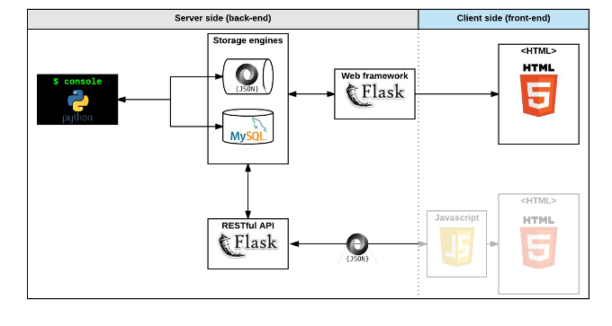

# AirBnB clone

The goal of the project is to deploy a simple copy of the [AirBnB Website](https://www.airbnb.com/)
The complete web application will be composed of:

- A command interpreter to manipulate data without a visual interface, like in a Shell (perfect fo development and debugging)
- A website (the front-end) that shows the final product to everybody: static and dynamic
- A database or files that store data (data=objects)
- A API that provides a communication interface between the front-end and your data (retrieve, create, delete, update them)

## Concepts to learn

- [Unittest](https://docs.python.org/3.4/library/unittest.html#module-unittest)
- Python packages
- Serialization/Deserialization
- *args, **kwargs
- datetime

## Steps

Each step will link to a concept:

## The Console

- create your data model
- manage (create, update, destroy, etc) objects via a console / command interprete
- store and persist objects to a file (JSON file)

The first piece is to manipulate a powerful storage system. This storage engine will give us an abstraction between "My object" and "How they are stored and persisted". This means: from the command interpreter itself and from the front-end and RestAPI.

This abstraction will also allow us to change storage easily without updating all of your codebase.

The console will be a tool to validate this storage engine

## Web static

- learn HTML/CSS
- create the HTML of your application
- create template of each object

## MySQL storage

- replace the file storage by a Database storage
- map your models to a tabke in database by using O.R.M.

## Web framework - templating

- create the first web server in Python
- makes static HTML file dynamic by sing objects stored in a file or database

## RESTful API

- expose all objects stored via a JSON web interface
- manipulate your objects via a RESTful API

## Web dynamic

- learn JQuery
- load objects from the client side by using own RESTful API

## Files and Directories

- **models** directory will contain all classes used for the entire project.
- **test** directory will contain all unit tests.
- **console.py** file is the entry of our command interpreter.
- **models/base_model.py** file is the base class of all our models. It contains common elements:

  - attributes: *id, created_at* and *updated_at*
  - methods: *save()* and *to_json()*

- **models/engine** directory will contain all storage classes.

## Data Diagram

